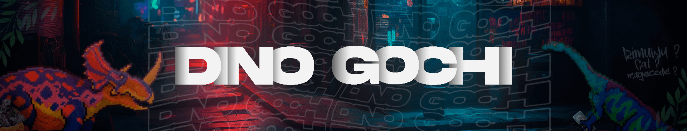
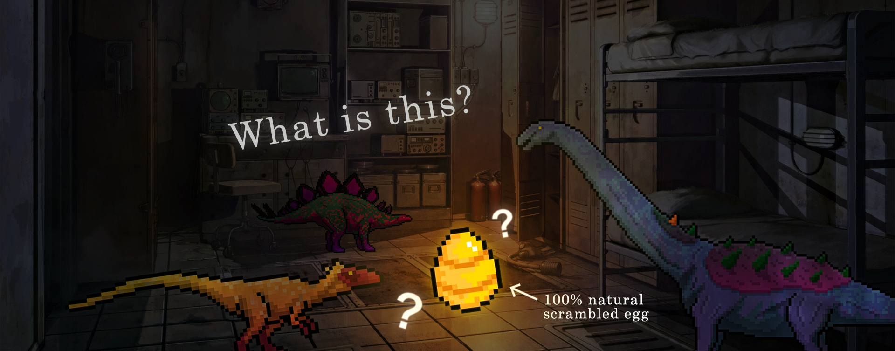

# DinoGochi - telegram.bot на python

Телеграмм бот по типу тамагочи, только с динозаврами!
Игровой бот где вы должны ухаживать за своим динозавров, но тут присутствуют нотки рпг.

 > Ссылки:
 > - Бот: https://t.me/DinoGochi_bot
 > - Канал: https://t.me/DinoGochi
 > - Форум: https://t.me/DinoForum
 > - Создатель: https://t.me/AS1AW

### 🦕 | О боте

- Заботьтесь о своём друге, играйте вместе с ним!

- Путешествуйте вместе с динозавром в лучших идеях Fallout.

- Занимайтесь крафтом, творите, торгуйте!

<!-- - Покоряйте подземелья, сражайтесь с злыми тварями!
 -->

- Присоединяйтесь к огромному сообществу друзей! А так же...
- Присоединяйтесь к этому увлекательному РПГ миру динозавров!

### 🛠 | Для запуска бота
#### Локально
- Установите 3-ю версию Python
- Бот может стоять как на старой `3.8`, так и на новой `3.11` (Основной бот работает на `3.11`)
- Далее, установите все библиотеки из файла `requirements.txt`
>
    # Windows or Linux
    pip install -r requirements.txt

- Установите базу данных на пк
• [# Windows](
    https://metanit.com/nosql/mongodb/1.2.php
   )
• [# Linux](
    https://www.dmosk.ru/miniinstruktions.php?mini=mongodb-ubuntu
   )
- Запустите файл `config.py` для создания файла конфигурации
- Файл должен быть создан и перемещён в ту же директории, что и файл `main.py`
- Пример запуска: 
>
    python bot\config.py
- Переместите файл в одну директорию с файлом `main.py`
- В `config.json` обязательно укажите: 
  - bot_token: "Токен бота из BotFather"
  - bot_devs: [id админов бота]
  - mongo_url: (Если база не на локальном сервере) "[mongo url кластера](https://gist.github.com/DeltaCoderr/0de27e6088822302dcb27db1827d64c1?permalink_comment_id=3676453)"
  - advert_token: "[рекламный токен](https://gramads.net/)"
- Запустите файл `main.py` и наслаждайтесь!
  
#### Docker
- Установите [Docker Engine](https://docs.docker.com/engine/install/)
- Запустите файл `config.py` для создания файла конфигурации
- Файл должен быть создан и перемещён в ту же директории, что и файл `main.py`
- Пример запуска: 
>
    python bot\config.py
> - Переместите файл в одну директорию с файлом `main.py`
- В `config.json` обязательно укажите: 
  - bot_token: "Токен бота из BotFather"
  - bot_devs: [id админов бота]
  - mongo_url: (Если база не на локальном сервере) "[mongo url кластера](https://gist.github.com/DeltaCoderr/0de27e6088822302dcb27db1827d64c1?permalink_comment_id=3676453)"
  - advert_token: "[рекламный токен](https://gramads.net/)"
- Отредактируйте `docker-compose.yml`
- Запустите:
>
    docker compose build
    docker compose up
- Наслаждайтесь докером!

### 📜 | Последнее

- 2.6v - 🎲 | ДНД механики в боте.
- 2.5v - 🎰 | Окончание рекламной интеграции в боте.
- 2.4.9v - 👑 | Донат через звёзды.

- 2.4v - 🏳 | Многоязыность. Автоматическая поддержка 4+ языков.
- 2.3v - 🎫 | Рекламная интеграция, скупщик.
- 2.2v - 🎩 | Оптимизация и фиксы.
- 2.1v - 🍣 | Стабильная версия с большими фиксами.

- 2.0v - 🍡 | Полностью переписанная с нуля версия бота.
- 1.4v - 🌭 | Новая еда и различные улучшения.
- 1.3v - 📜 | Квесты.
- 1.2v - 🗻 | Обновление подземелий.

### ☄ | Планы

- 2.8v - 🗻 | ДНД подземелье.
- 3.0v - 🧬 | Генетика.
- 3.5v - 🧥 | Костюмы, скины.
- 4.0v - 🏠 | Система деревень.