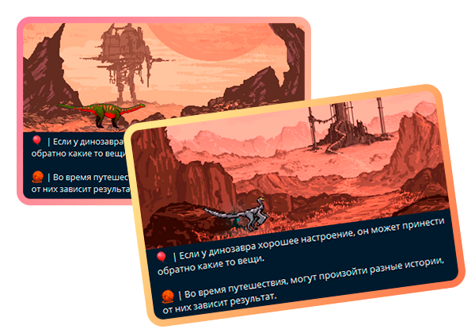
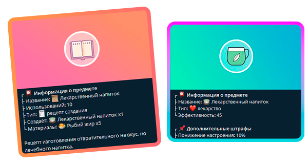
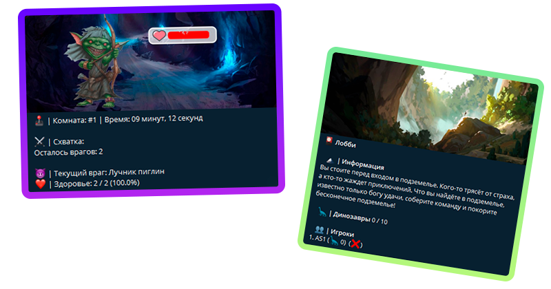

# DinoGochi - telegram.bot на python
Телеграмм бот по типу тамагочи, только с динозаврами!
Игровой бот где вы должны ухаживать за своим динозавров, но тут присутствуют нотки рпг.

 > Ссылки:
 > - Бот: https://t.me/DinoGochi_bot
 > - Создатель: https://t.me/AS1AW

### 🦕 | О боте

- В боте вы должны заботится о своём динозавре. Развлекайте его, кормите и тд.

- Путешествуйте вместе с динозавром в лучших идеях Fallout 86.

- Занимайтесь крафтом, творите!

- Покоряйте подземелья, сражайтесь с злыми тварями!

- Скорее присоединяйтесь в этот рпг мир динозавров!

### 🛠 | Для запуска бота
- Установите 3-ю версию Python
- Бот может стоять как на старой 3.8, так и на новой 3.11 (Основной бот работает на 3.11)
- Далее, установите все библиотеки из файла requirements.txt
>
    # Windows
    pip install requirements.txt

>
    # Linux
    pip install -r requirements.txt

- Установите базу данных на пк
• [# Windows](
    https://metanit.com/nosql/mongodb/1.2.php
   )
• [# Linux](
    https://www.dmosk.ru/miniinstruktions.php?mini=mongodb-ubuntu
   )
- Запустите файл **config.py** для создания файла конфигурации
- Файл должен быть создан и перемещён в ту же директории, что и файл "main.py"
- Пример запуска: (Или просто кликните 2 раза по файлу если вы с Windows)
> - ...\DinoGochi> python bot\config.py
> - Переместите файл в одну директорию с файлом main.py

- В config.json обязательно укажите: 
> - bot_token: "Токен бота из BotFather"
> - bot_devs: [id админов бота]
> - mongo_url: (Если база не на локальном сервере) "[mongo url кластера](https://gist.github.com/DeltaCoderr/0de27e6088822302dcb27db1827d64c1?permalink_comment_id=3676453)"

- Запустите файл main.py и наслаждайтесь!

### 📜 | Последнее

- 2.0v - 🍡 | Полностью переписанная с нуля версия бота.
- 1.4v - 🌭 | Новая еда и различные улучшения.
- 1.3v - 📜 | Квесты.
- 1.2v - 🗻 | Обновление подземелий.
